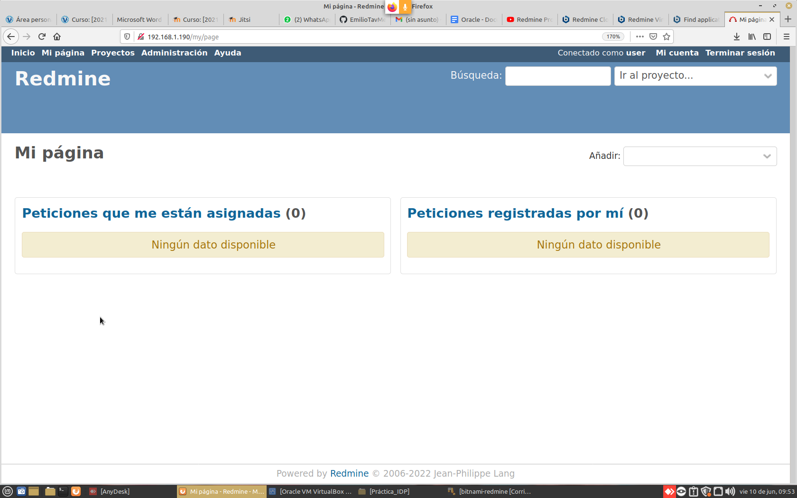
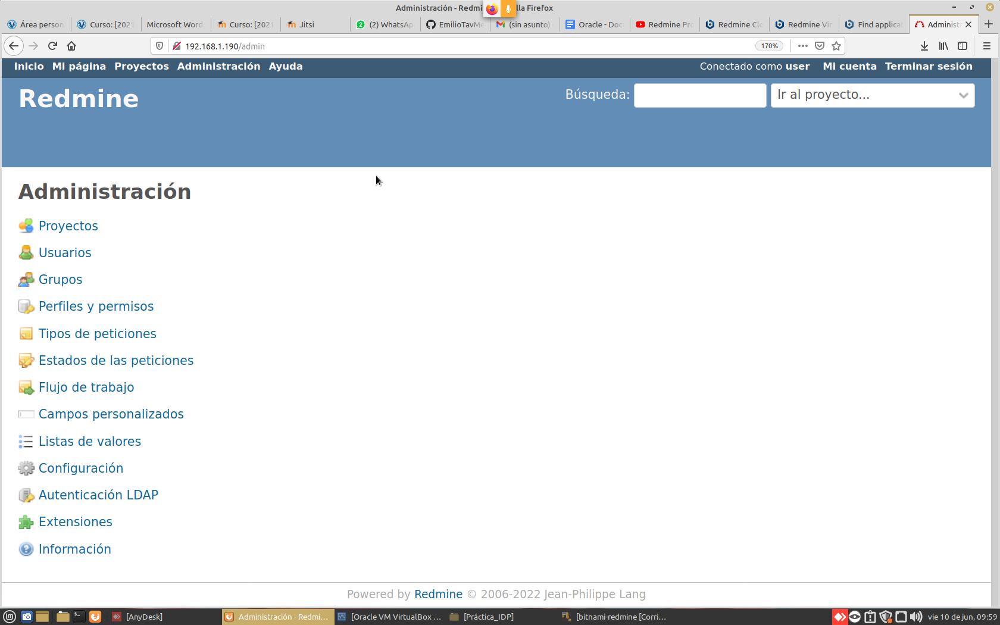
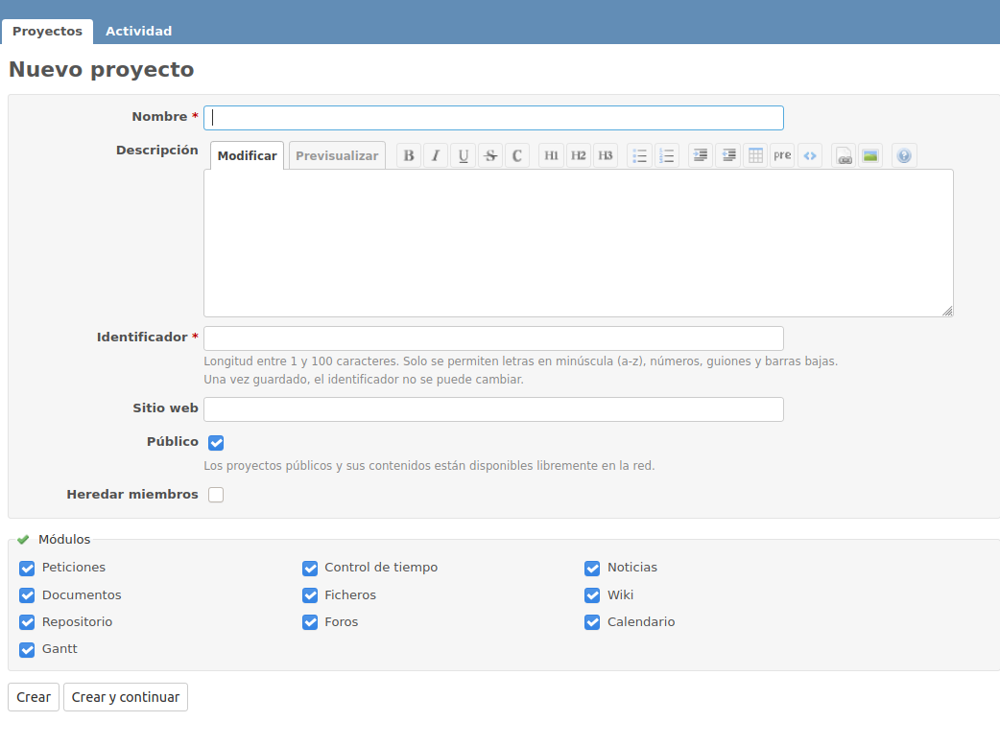
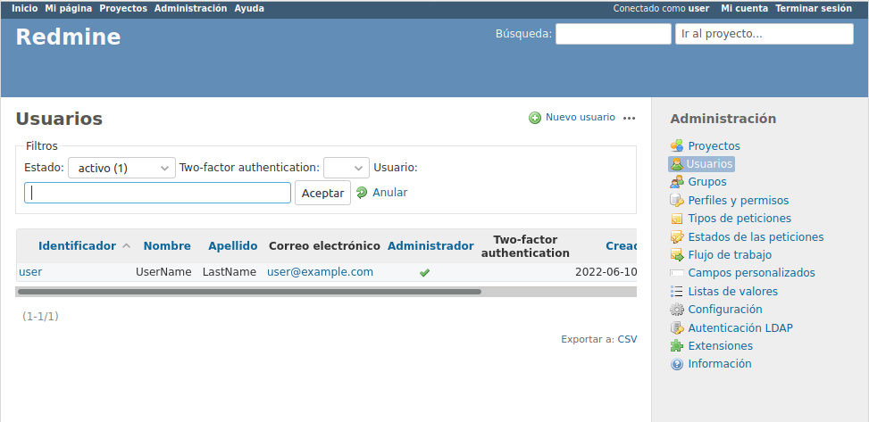
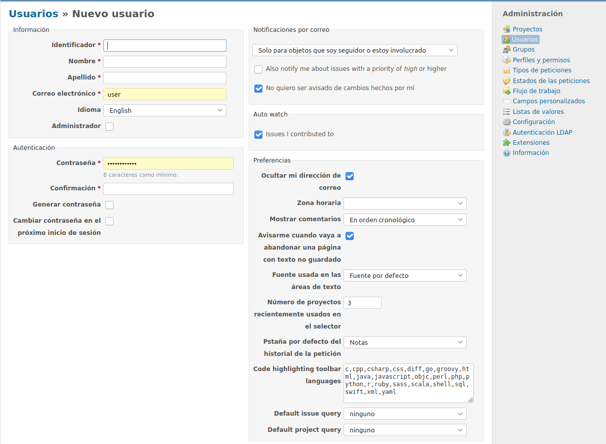
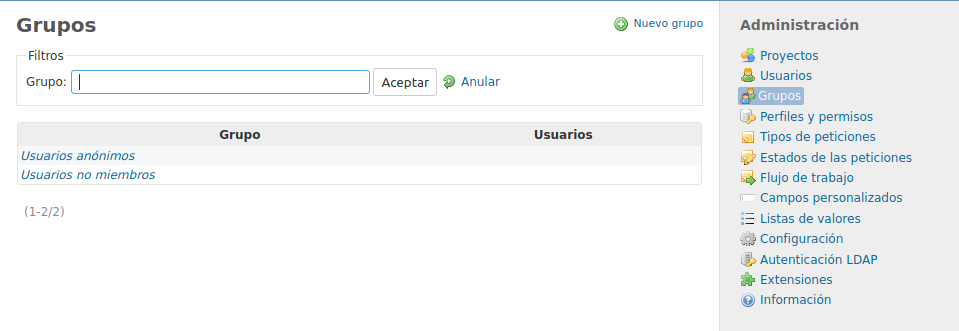
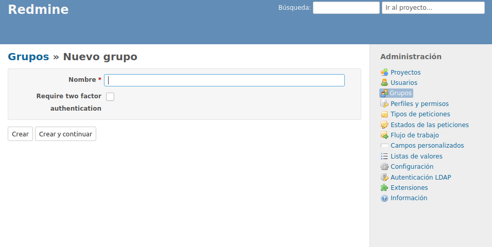
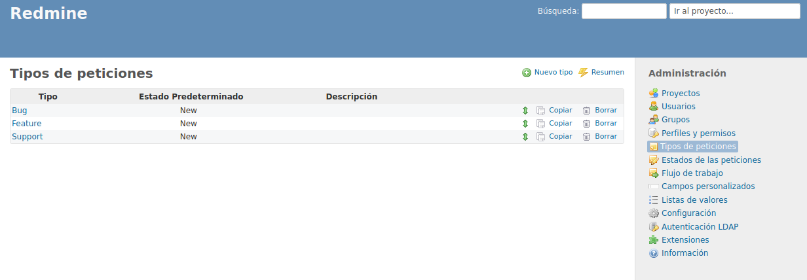
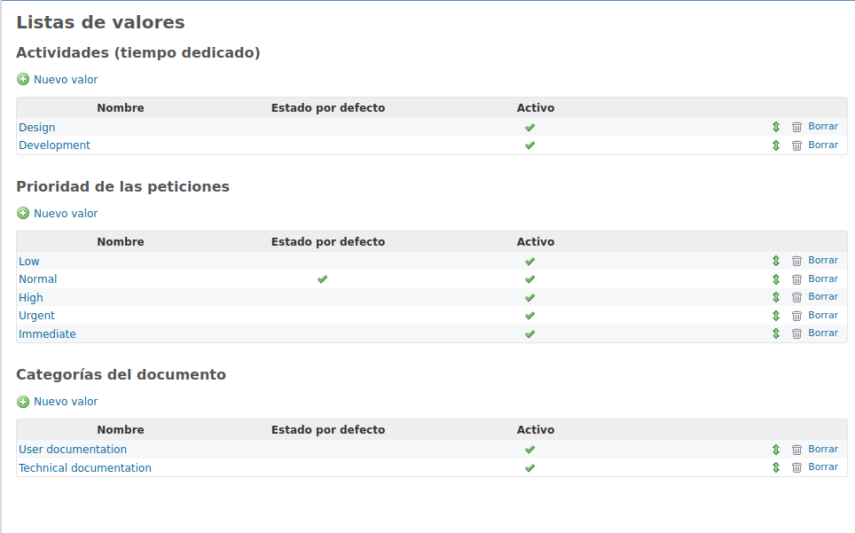
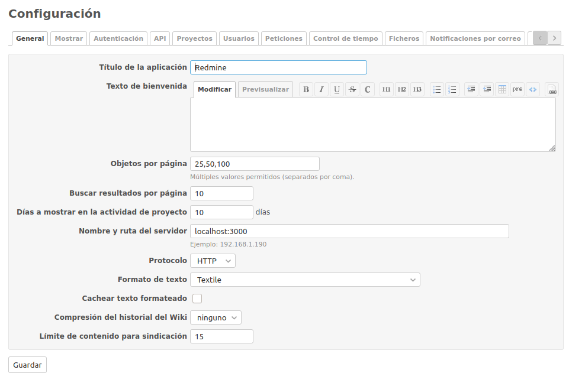

Una vez arrancada y loguearnos, accederemos correctamente a nuestro servidor RedMine y una vez dentro, seleccionaremos el botón de administración.

Una vez dentro, iremos uno a uno explicando todo su funcionamiento y uso.

Empezamos con el proyecto en el que como podemos ver en la imagen nos da la opción de crear, modificar y crear un proyecto

Dentro de las otras opciones nos aparece la opción de usuarios, que consiste tanto en la elaboración de nuevos usuarios como dotarle de privilegios en los grupos, proyetos que crees.

Otra opción dentro de **RedMine** es la creación, eliminación y actualización de grupos.

Aquí tenemos la Infromación interna de RedMine.

Y por último tenemos la configuración de RedMine en donde puedes mdificar sus registros, ya sea cambiar el puerto, el nombre, agregarle un texto de bienvenida y toda la configuración interna del servidor RedMine.
