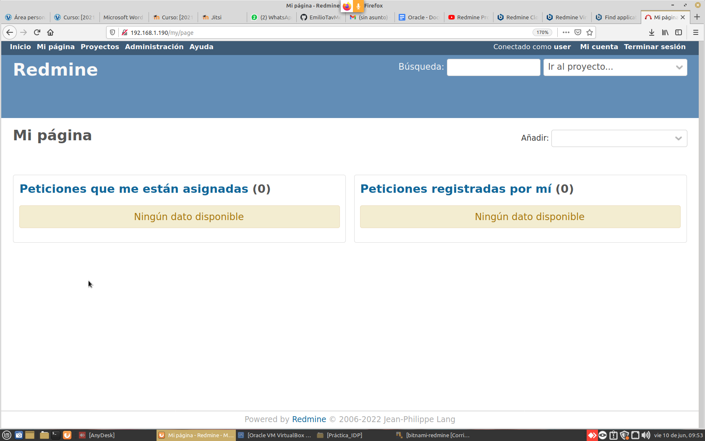

[Link para la descarga de RedMine](https://www.redmine.org/projects/redmine/wiki/Download)

Aqui tenemos el link de descarga de RedMine.


Buscamos en Bitnami una extension vagrant para poder utilizar el RedMine en nuestro ordenador.


Nos descargamos el vagrant y con una máquina recien creada la importamos.


Al arrancar la máquina nos pedirá que ingresemos un nombre de usuario y contraseña **importante, hacer caso a las indicaciones que hay en la máquina**.


Una vez puesto los credenciales nos pedira que ingresemos una nueva contraseña para nuestra máquina bitnami.


Como podemos observar ya hemos cmabiado la contraseña correctamente.


**Nota**: Hay que sacar nuestra dirección IP con el comando:

```bash
ip address
```


Ahora en nuestro PC ingresaremos la IP de la máquina


Una vez puesta la IP nos saldra esta pantalla en la que deberemos de poner nuestros datos para poder iniciar sesión satisfactoriamente. 


